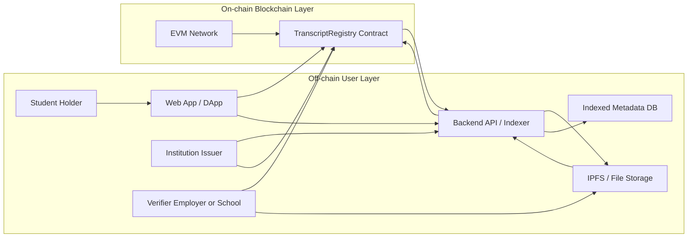
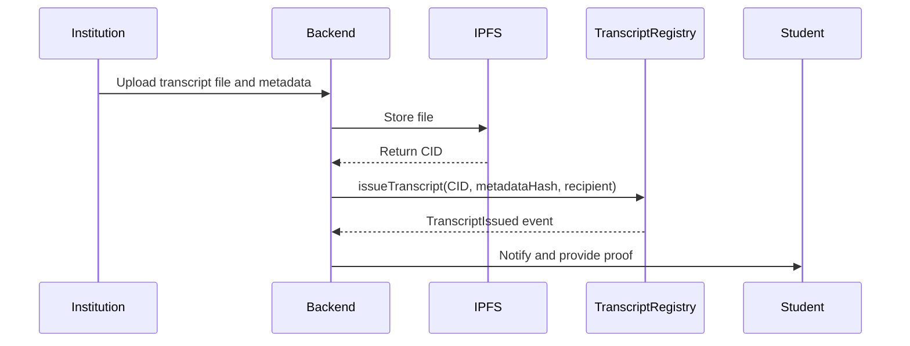
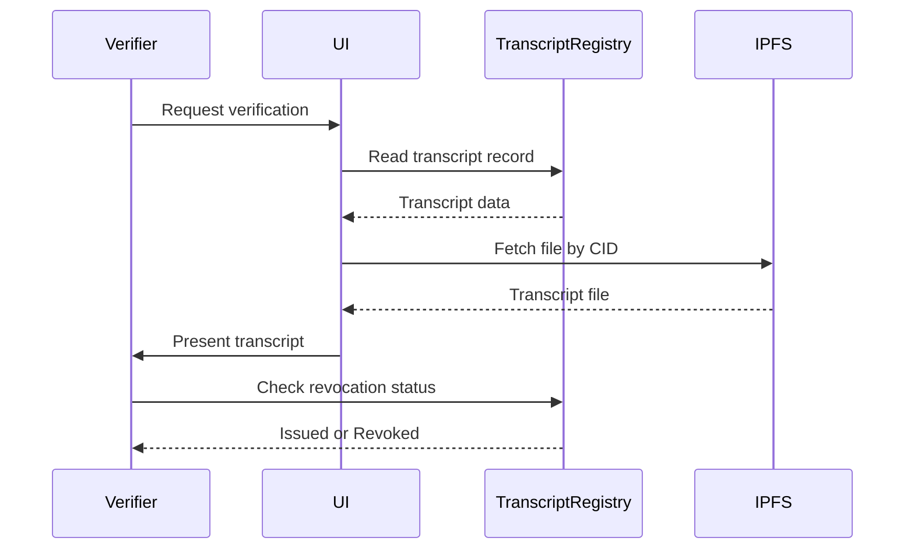
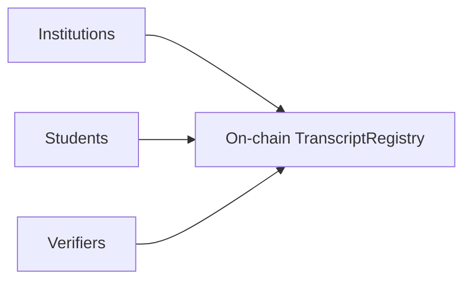
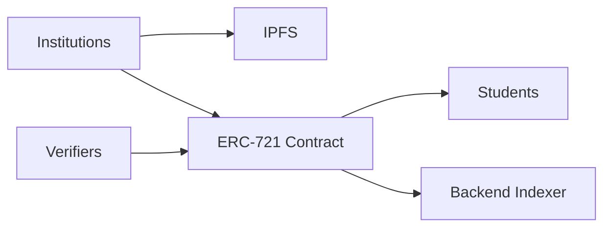

# TranscriptRegistry — Architecture Overview

This file contains the overall architecture flowchart, the issue and verify sequence diagrams, and the two adaptations (fully on-chain and ERC-721 wrapping).  
All Mermaid diagrams are compatible with **GitHub-flavored Mermaid rendering**.

---

## 1) Overall architecture (Mermaid flowchart)

## 2) Sequence diagrams

### 2.1 Issue flow (sequence diagram)

### 2.2 Verify flow (sequence diagram)

## 3) Adaptations

### 3.1 Fully on-chain storage (simplified)

Tradeoff: higher gas and storage costs with simpler verification.

### 3.2 ERC-721 wrapping (transcript as NFT)

