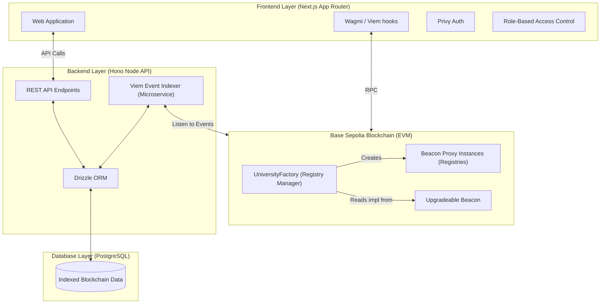
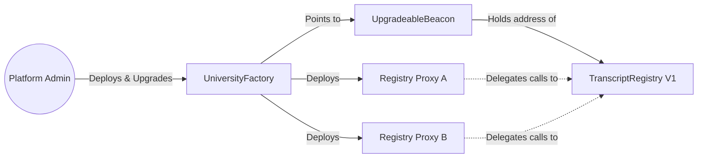
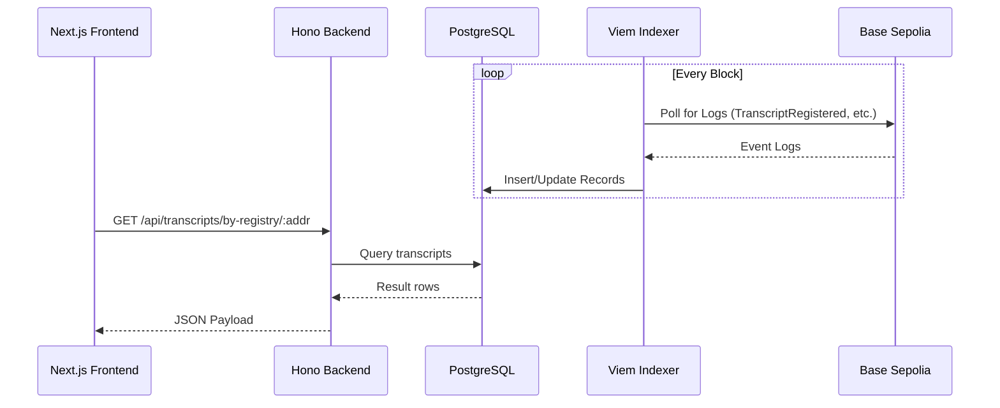
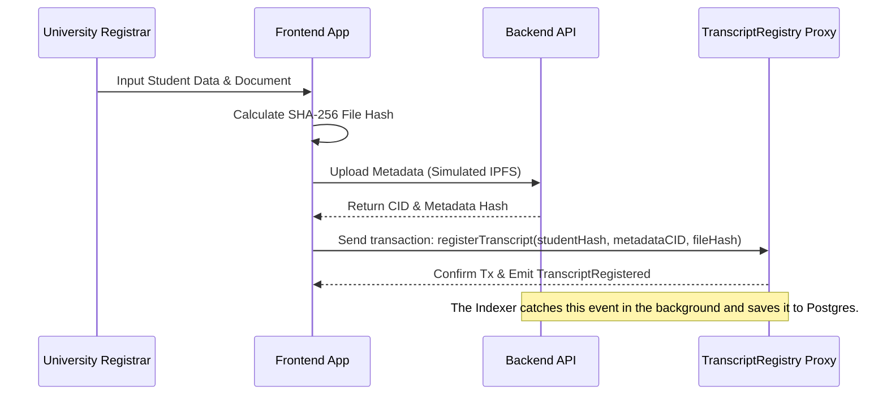

# TranscriptRegistry Architecture Overview

This file contains the overall architecture flowchart, sequence diagrams, and structural overview for the live production MVP. All Mermaid diagrams are compatible with **GitHub-flavored Mermaid rendering**.

---

## 1) Overall System Architecture

```mermaid
flowchart TD
  subgraph Frontend["Frontend Layer (Next.js App Router)"]
    UI["Web Application"]
    Wagmi["Wagmi / Viem hooks"]
    Auth["Privy Auth"]
    RBAC["Role-Based Access Control"]
  end

  subgraph Backend["Backend Layer (Hono Node API)"]
    API["REST API Endpoints"]
    Indexer["Viem Event Indexer (Microservice)"]
    Drizzle["Drizzle ORM"]
  end

  subgraph DB["Database Layer (PostgreSQL)"]
    Postgres[(Indexed Blockchain Data)]
  end

  subgraph Blockchain["Base Sepolia Blockchain (EVM)"]
    Factory["UniversityFactory (Registry Manager)"]
    Beacon["Upgradeable Beacon"]
    Proxies["Beacon Proxy Instances (Registries)"]
  end

  %% Relationships
  UI <--> |API Calls| API
  Wagmi <--> |RPC| Blockchain
  Indexer <--> |Listen to Events| Blockchain
  API <--> Drizzle
  Indexer <--> Drizzle
  Drizzle <--> Postgres
  Factory --> |Creates| Proxies
  Factory --> |Reads impl from| Beacon
```

## 2) Smart Contract Architecture (Beacon Proxy Pattern)

```mermaid
flowchart LR
  Admin((Platform Admin))
  Factory[UniversityFactory]
  Beacon[UpgradeableBeacon]
  Impl[TranscriptRegistry V1]
  Proxy1[Registry Proxy A]
  Proxy2[Registry Proxy B]

  Admin -->|Deploys & Upgrades| Factory
  Factory -->|Points to| Beacon
  Beacon -->|Holds address of| Impl
  Factory -->|Deploys| Proxy1
  Factory -->|Deploys| Proxy2
  Proxy1 -.->|Delegates calls to| Impl
  Proxy2 -.->|Delegates calls to| Impl
```

## 3) Backend API Flow

```mermaid
sequenceDiagram
  participant UI as Next.js Frontend
  participant API as Hono Backend
  participant DB as PostgreSQL
  participant Indexer as Viem Indexer
  participant Chain as Base Sepolia

  %% Background indexing
  loop Every Block
    Indexer->>Chain: Poll for Logs (TranscriptRegistered, etc.)
    Chain-->>Indexer: Event Logs
    Indexer->>DB: Insert/Update Records
  end

  %% Client request
  UI->>API: GET /api/transcripts/by-registry/:addr
  API->>DB: Query transcripts
  DB-->>API: Result rows
  API-->>UI: JSON Payload
```

## 4) Issue Transcript Sequence

```mermaid
sequenceDiagram
  participant Registrar as University Registrar
  participant UI as Frontend App
  participant API as Backend API
  participant Chain as TranscriptRegistry Proxy

  Registrar->>UI: Input Student Data & Document
  UI->>UI: Calculate SHA-256 File Hash
  UI->>API: Upload Metadata (Simulated IPFS)
  API-->>UI: Return CID & Metadata Hash
  UI->>Chain: Send transaction: registerTranscript(studentHash, metadataCID, fileHash)
  Chain-->>UI: Confirm Tx & Emit TranscriptRegistered
  Note over API,Chain: The Indexer catches this event in the background and saves it to Postgres.
```

