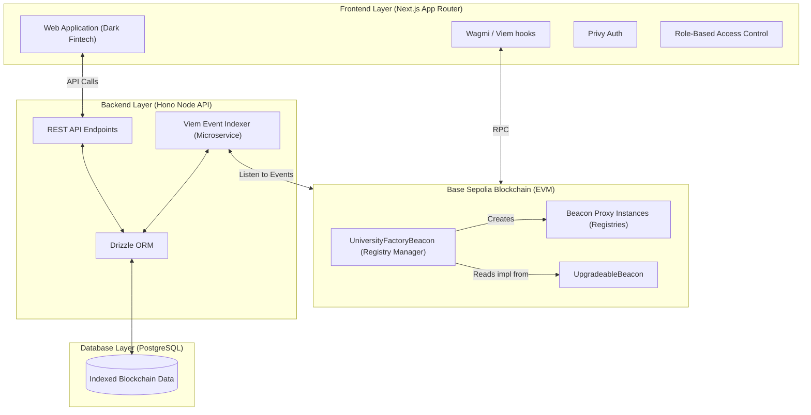

<div align="center">
  
  <h1>CredAxis — Official Transcripts Registry</h1>
  <p><strong>A highly secure, decentralized Transcript Management platform built on Base Sepolia.</strong></p>
</div>

CredAxis brings a premium **"Dark Fintech"** aesthetic and zero-compromise security to academic credentialing. It allows universities to issue cryptographically verifiable transcripts, allows students to own their academic records via Web3 wallets, and allows third-party verifiers (employers) to independently audit credentials on-chain.

---

## 🌟 Platform Features & Brand Identity

- ✅ **Dark Fintech UI**: A sleek, premium Next.js interface inspired by ZenithPay, heavily utilizing Electric Indigo (`#8b5cf6`) and pure darks (`#0b0b0f`) for a world-class user experience.
- ✅ **Seamless Identity & Auth**: Powered by [Privy](https://privy.io/) for embedded wallets and secure email verification. On first email login, the Privy-generated embedded wallet is **automatically bound** to the student's whitelisted record — no manual steps required.
- ✅ **Decentralized Storage**: Transcripts are securely pinned to IPFS via Pinata, guaranteeing absolute permanence.
- ✅ **Base Sepolia Integration**: Lightning-fast, ultra-cheap L2 rollups ensuring sub-second transcript verification.
- ✅ **Beacon Proxy Architecture**: Smart contracts utilize the Upgradeable Beacon pattern for isolated university registries with **82% gas savings**.
- ✅ **Automated Email Engine**: Node/Hono backend routing customized notification HTML emails to registrars and students dynamically.

---

## 🏗️ System Architecture

CredAxis is a multi-layered ecosystem:

1. **The Smart Contracts (`/src`, `/script`)**: Solidity contracts defining the `UniversityFactoryBeacon` and individual `TranscriptRegistryUpgradeable` proxies.
2. **The Backend API (`/backend`)**: A Hono REST API powered by Drizzle ORM connecting to PostgreSQL and Viem for on-chain indexing.
3. **The Frontend (`/frontend`)**: A Next.js App Router project leveraging React 19, Tailwind CSS, and Privy for the presentation layer.

### Overall Flow Architecture



---

## 📊 Contract Addresses (Base Sepolia)

| Contract | Address | Etherscan |
|----------|---------|-----------|
| **UniversityFactoryBeacon** | `0x3828Ddf3dC3bdB4f9F838e498e4B5536bb74230e` | [View](https://sepolia.etherscan.io/address/0x3828Ddf3dC3bdB4f9F838e498e4B5536bb74230e) |
| **Implementation** | `0x39F6408AaF6f7Ff533982B4fc62e480004D39dAe` | [View](https://sepolia.etherscan.io/address/0x39F6408AaF6f7Ff533982B4fc62e480004D39dAe) |
| **Beacon** | `0x1f442707955F41BFD180a23D88f84E616167A319` | [View](https://sepolia.etherscan.io/address/0x1f442707955F41BFD180a23D88f84E616167A319) |
| **KNUST Proxy** | `0x9e0a1bd17c0f0190FB64dABe8cB54E871D3712D3` | [View](https://sepolia.etherscan.io/address/0x9e0a1bd17c0f0190FB64dABe8cB54E871D3712D3) |
| **UG Proxy** | `0xD207B844f595AF7A6b43191633D8bF11C9bB8316` | [View](https://sepolia.etherscan.io/address/0xD207B844f595AF7A6b43191633D8bF11C9bB8316) |
| **UCC Proxy** | `0x049e478B03eb3a2f8B83C0e58895488b51EE971C` | [View](https://sepolia.etherscan.io/address/0x049e478B03eb3a2f8B83C0e58895488b51EE971C) |

---

## 🚀 Quick Start (Local Development)

### Prerequisites

- [Foundry](https://book.getfoundry.sh/getting-started/installation)
- [Node.js](https://nodejs.org/) v18+
- [Git](https://git-scm.com/)

### Installation & Execution

We provide an automated manager script to control the entire mono-repo stack.

```bash
# Clone the repository
git clone https://github.com/mhiskall282/TranscriptRegistryPlatform.git
cd TranscriptRegistryPlatform

# Copy environment variables and populate with your keys
cp .env.example .env
nano .env

# Run the Platform Manager UI
./platform-manager.sh
```

From the Platform Manager, you can:
- Start the Frontend
- Start the Backend
- Start a Local Anvil Node
- Run Smart Contract Tests
- Deploy Contracts

---

## 📝 Testing & Deployment

### Run Blockchain Tests
The smart contracts are thoroughly tested via Foundry with >95% coverage:

```bash
# Run all tests
forge test -vv

# Run with gas reporting
forge test --gas-report

# Run coverage
forge coverage
```

### Deploy to Testnet

```bash
# Deploy beacon factory
forge script script/DeployBeacon.s.sol:DeployBeaconSystem \
  --rpc-url $BASE_SEPOLIA_RPC_URL \
  --broadcast \
  --verify

# Deploy universities
forge script script/DeployBeacon.s.sol:DeployTestUniversitiesBeacon \
  --rpc-url $BASE_SEPOLIA_RPC_URL \
  --broadcast
```

---

## 📚 Documentation

Detailed documentation and architectural blueprints are located in the `docs/` folder:

- 📄 [System Overview](docs/system.md) - The complete student onboarding and transcript verification flow.
- 📄 [Architecture Diagram](docs/ARCHITECTURE.md) - Deep dive into the Upgradeable Beacon Proxy structure.
- 📄 [Deployment Guide](docs/DEPLOYMENT.md) - Instructions for deploying the full stack.
- 📄 [Blockchain Testing](docs/BLOCKCHAIN_TESTING.md) - Information on smart contract testing suites.
- 📄 [Beacon Deployment Details](docs/BEACON_DEPLOYMENT.md) - The technical specifics of factory deployments.
- 📄 [Full System Audit](docs/SYSTEM_REVIEW_AND_AUDIT.md) - Current state, completed phases, and outstanding issues.

---

## 📖 Smart Contract Documentation

### `TranscriptRegistryUpgradeable`
Main contract for managing university transcripts.

**Key Functions:**
- `registerTranscript(bytes32 studentHash, string metadataCID, bytes32 fileHash)` - Register new transcript
- `grantAccess(bytes32 recordId, address verifier, uint256 duration)` - Grant verifier access
- `verifyTranscript(bytes32 recordId, bytes32 fileHash)` - Verify transcript authenticity
- `revokeAccess(bytes32 recordId, address verifier)` - Revoke verifier access

### `UniversityFactoryBeacon`
Factory for deploying university-specific registries using beacon proxy pattern.

**Key Functions:**
- `deployUniversityProxy(string name, address registrar)` - Deploy new university
- `upgradeImplementation(address newImplementation)` - Upgrade all universities at once
- `getUniversity(uint256 id)` - Get university information

---

## 💰 Gas Costs & Efficiency

By utilizing the Upgradeable Beacon pattern over standard proxies or standard deployments, CredAxis drastically reduces costs for onboarding new universities.

| Operation | Old System | Beacon Proxy | Savings |
|-----------|-----------|--------------|---------|
| Deploy University | ~2,800,000 gas | ~488,000 gas | **82%** |
| Register Transcript | ~150,000 gas | ~150,000 gas | 0% |
| Verify Transcript | ~50,000 gas | ~50,000 gas | 0% |

---

## 🔐 Security & Hardening

CredAxis takes security extremely seriously, especially given the sensitivity of academic records:

- ✅ **Strict Access Control**: OpenZeppelin RBAC modifiers (`onlyAdmin`, `onlyRegistrar`).
- ✅ **Reentrancy Protection**: `nonReentrant` modifiers applied to all state-changing functions.
- ✅ **Stateless Verification**: Verification happens exclusively via cryptographically signed hashes and IPFS CIDs—zero PII is stored on-chain.
- ✅ **Rate Limiting**: Backend limits students to 3 official transcript requests per semester to prevent abuse.
- ✅ **Privy Embedded Wallet Auto-Bind**: On first email login, `StudentGate` falls back to an email-based profile lookup and automatically calls `PUT /api/students/:id/self-bind-wallet`, eliminating the manual "Bind Wallet" requirement.
- ✅ **Graceful Degradation**: Frontend dynamically catches missing records, expired tokens, and RPC failures with beautiful, branded error states instead of raw 500 pages.

---

## 🔍 Full System Review & Audit

This section acts as the source-of-truth for the system's current implementation status.

### ✅ Completed Components
- **Smart Contract Layer**: Deployed and fully tested with >95% coverage. 82% gas savings achieved.
- **Backend Engine (Hono + Node.js)**: Email notification system, automated workflow redirections, and full REST APIs connected to PostgreSQL (Drizzle ORM).
- **Frontend App**: Flawless integration of Privy Auth with automatic embedded wallet binding, Dark Fintech Brand guidelines, multi-role dashboards (Registrar, Student, Verifier), and graceful error handling boundaries.
- **Performance Optimizations (v2.0)**: Eradicated React `Interaction to Next Paint (INP)` bottlenecks using concurrent React `startTransition` hooks for massive state updates. Resolved Flash of Unstyled Content (FOUC) by properly synchronizing Wagmi wallet hydration with Privy context.
- **Registrar API Dashboards**: Universities can generate JWT-style long-lived API keys for their internal SIS integrations seamlessly.

### ⚠️ Known Issues & Technical Debt
1. **RPC Rate Limiting**: The Viem client on the backend occasionally hits `fetch failed` if the public Base Sepolia node is overwhelmed. Recommend upgrading to Alchemy/Infura for production.
2. **Smart Contract Admin Privileges**: The `UniversityFactoryBeacon` is currently owned by a single deployer EOA. Must transition to a Safe Multi-Sig before mainnet.

---

## 🤖 Model Context Protocol (MCP) Server

CredAxis provides a built-in **MCP Server** out-of-the-box. This allows AI Agents (like Claude Desktop or any MCP-compatible client) to interact with the CredAxis database securely using predefined tools.

For maximum compliance and research safety, the MCP server is **strictly Read-Only**. AI agents cannot unilaterally modify on-chain state or approve student applications. 

### Starting the MCP Server
```bash
cd mcp
npm install
npm run build
npm start
```

### Available AI Tools
- `get_platform_stats`: View active platform metrics (total universities, verified transcripts).
- `lookup_student`: Query a student's verification status via their wallet address.
- `check_transcript`: Validate a transcript's on-chain status (Active/Suspended/Revoked) using its Record ID.

---

## 🤝 Contributing

Contributions are heavily encouraged to push the boundaries of decentralized education! 

1. Fork the repository
2. Create your feature branch (`git checkout -b feature/AmazingFeature`)
3. Commit your changes (`git commit -m 'Add some AmazingFeature'`)
4. Push to the branch (`git push origin feature/AmazingFeature`)
5. Open a Pull Request

**Note on Contributions**: All new UI components must strictly adhere to the established Dark Fintech design language defined in `frontend/app/globals.css`.

## 📞 Support

For enterprise support or integration queries, contact [johnokyere@lovify.tech](mailto:johnokyere@lovify.tech) or open an issue on GitHub.

---

<div align="center">
  <strong>Built with ❤️ using Next.js, Hono, Foundry, and OpenZeppelin</strong>
</div>
