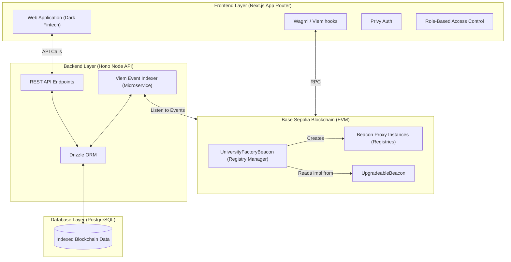
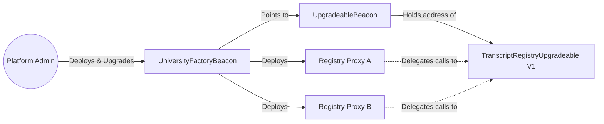
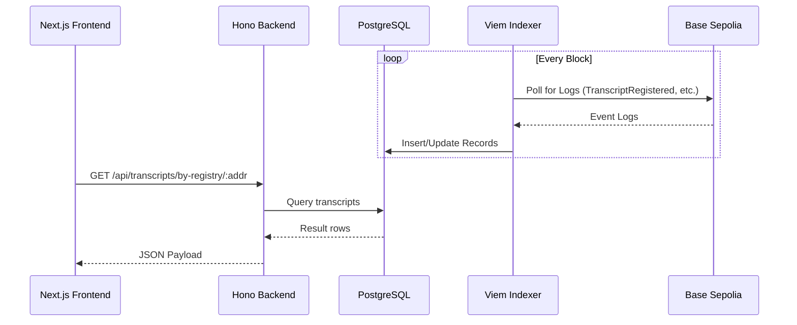
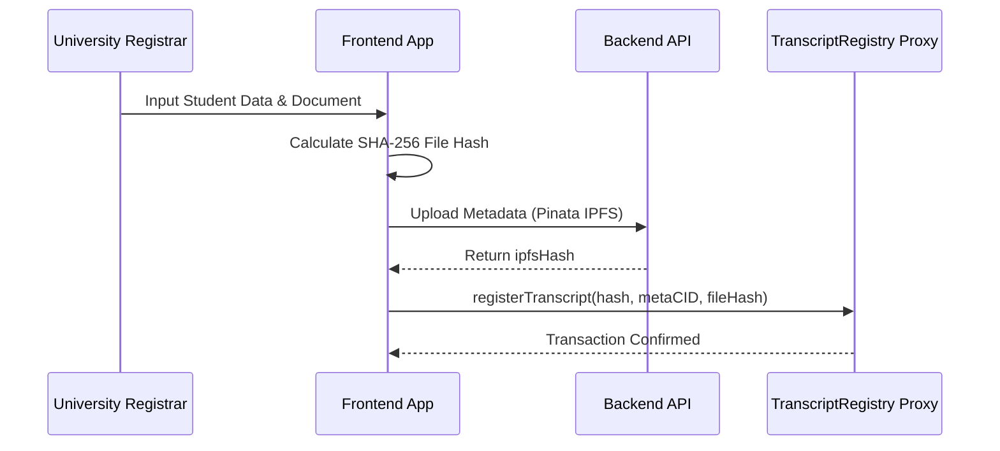
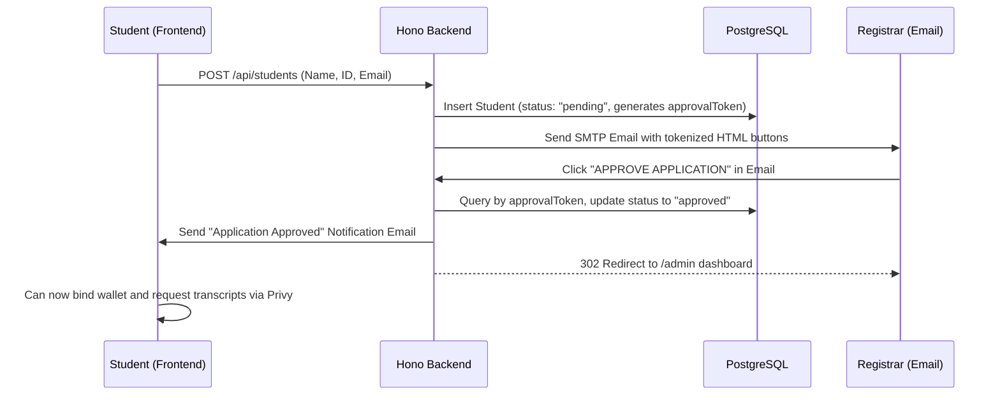
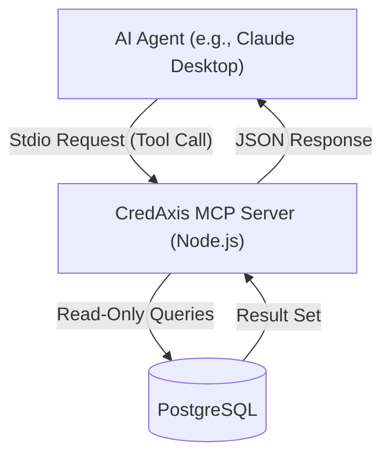

# CredAxis Architecture Overview

This file contains the overall architecture flowchart, sequence diagrams, and structural overview for the live production MVP. All Mermaid diagrams are compatible with **GitHub-flavored Mermaid rendering**.

---

## 1) Overall System Architecture

## 2) Smart Contract Architecture (Beacon Proxy Pattern)

## 3) Backend API Flow

## 4) Issue Transcript Sequence

## 5) Student Registration & Email Approval Flow

## 6) AI Integration Layer (MCP Server)

*For complete tool schema details, see [MCP_SERVER.md](file:///c:/Users/user/Desktop/TranscriptRegistry/docs/MCP_SERVER.md).*
