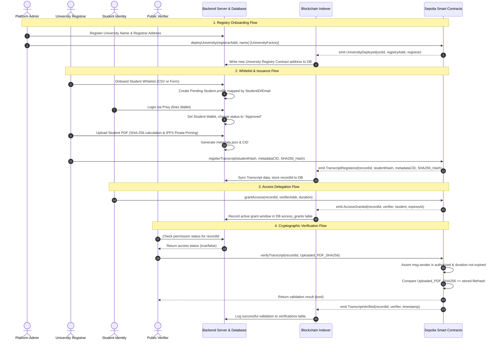

# CredAxis — System Audit & Architecture Guide

This report details the architectural design, workflow diagrams, and a security-focused audit of the CredAxis platform codebase.

---

## 1. System Components & Flow Diagram

The diagram below maps the interaction boundaries between the University Registrar, the Graduate/Student, the Public Verifier, the backend database, and the Sepolia Ethereum blockchain.

---

## 2. On-Chain Smart Contract Audit

The smart contract layer consists of two core structures:
1. **`UniversityFactory.sol`**:
   - Acts as the registry deployment hub.
   - Leverages a multi-tenant factory pattern where every university gets its own isolated `TranscriptRegistry` instance.
   - Emits `UniversityDeployed` which serves as the indexer trigger.
2. **`TranscriptRegistry.sol`**:
   - Manages record identities. Transcripts are stored in the `transcripts` mapping.
   - **Student Identity Privacy:** Key identifiers are obfuscated using `keccak256` hashing (`studentHash`). When a student grants or revokes access, their ownership is verified cryptographically by computing `keccak256(abi.encodePacked(msg.sender))` and comparing it against the stored `studentHash`.
   - **Access Control Matrix:** Employs a nested mapping: `mapping(bytes32 => mapping(address => AccessGrant)) public accessControl` to check verification rights dynamically.

### Strength Points
* **Isolated Registries:** University contract boundaries prevent multi-tenant data contamination. An issue with one university contract does not compromise other university registries.
* **On-Chain Zero-Knowledge-like Privacy:** Storing a hash of the student's address rather than the raw address prevents public observers from scanning the blockchain to map transcripts directly to specific identities.

### Suggestions for Improvement
> [!TIP]
> - **Registry Upgradability:** Transition all deployments to use proxy clones (`Clones.sol` / ERC-1167) instead of full contract deployments. Deploying full contracts for each university consumes heavy gas (~1.8M gas). Clones reduce this to ~100k gas.
> - **Custom Revert Errors:** Replace `require` string error messages with Solidity custom errors (`error Unauthorized()`) to reduce bytecode size and transaction execution gas cost.

---

## 3. Off-Chain Indexer Audit (`sync.ts`)

The indexer leverages `viem` to continuously parse the Sepolia network starting from a checkpoint block.

### Operational Loop
1. Queries `UniversityFactory` logs for new `UniversityDeployed` events.
2. Registers newly deployed contracts into the local `universities` database table.
3. Retrieves the complete list of university registry contract addresses dynamically from the database.
4. Performs a single collective RPC request to retrieve `TranscriptRegistered`, `TranscriptStatusUpdated`, and `TranscriptVerified` events across all registered registry addresses.
5. Saves the last parsed block state in the `indexer_state` table to guarantee that block scanning resumes correctly after restarts.

### Strength Points
* **Dynamic Addressing:** Automatically hooks new registries on the fly. The indexer doesn't require restarts when new universities are registered.
* **Bulk Log Scanning:** Querying logs using arrays of addresses (via `viem.getLogs({ address: registryAddresses })`) limits RPC network roundtrips.

---

## 4. Backend Express API Audit (`index.ts`)

The Express server handles IPFS uploads (using Pinata SDK), student profile registrations, access control checking, and analytics endpoints.

### Key Implementation Patterns
* **Auth Gate Verification:** Employs a robust `verifyAuth` middleware that pulls Privy's signing keys from the Privy JWKS keyset and validates incoming JWT signatures, securing sensitive routes like `/api/ipfs/upload`.
* **Drizzle ORM Connection:** Connects cleanly to Postgres, with transactions mapped explicitly via Drizzle schemas.

---

## 5. Frontend & UI Architecture Audit

The React/Next.js frontend employs standard App Router structures.

### Design and Styling
* **Tailwind v4 Clean Utility Tokens:** Custom OKLCH color palettes (such as `bg-ca-accent`, `text-ca-teal`, and `border-ca-border`) are configured inside `@theme inline` in `globals.css` and compiled as first-class utility classes.
* **Global Theme Provider:** Theme state is initialized on mount from `localStorage` inside the global `Web3Provider` wrapper, eliminating duplicate layout-level state changes.
* **Responsive Visual Contrast:** Surfaces and borders are cleanly structured using physical color tokens that transition correctly between Light and Dark mode.
* **Interactive Prototyping:** A custom Zustand role-switch store is wired to a developer panel in `settings` to allow instant role testing without deploying new smart contracts.

---

## 6. Unified Authentication Architecture (Email & Web3)

To bridge the gap between non-crypto-native users and blockchain infrastructure, the platform implements a hybrid identity system:

### 6.1 Administrator Identity Verification
Because the Platform Admin must sign transactions via the Factory Contract owner wallet, the system uses Web3 identity primarily. However, for a unified experience:
- The system recognizes a hard-coded super-admin email (`johnokyere282@icloud.com`).
- By utilizing **Privy Account Linking**, the Admin can log in via email and link their `0x` owner wallet. The frontend `rbac-provider.tsx` automatically resolves authorization by checking both the active wallet and all linked Privy accounts against the known admin credentials.

### 6.2 Manual Wallet Binding for Students
When registrars bulk-whitelist students via CSV, those profiles initially exist strictly off-chain as Web2 records without associated wallets.
- **Registrar Authority:** The dashboard includes an "Edit Wallet" feature allowing the Registrar to manually input and bind a wallet address to a whitelisted student.
- **Immediate Issuance:** This allows the Registrar to issue transcripts immediately without waiting for the student to onboard via the frontend.

### 6.3 Domain Isolation
The sidebar and routing strictly segment views:
- **Platform Admins** see the global ecosystem, server logs, and the "Registered Institutions" (Registrar Manager) panel.
- **Registrars** are restricted to their assigned University Dashboard and transcript issuance flows.
