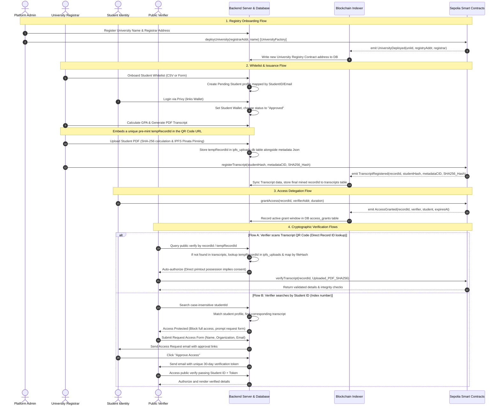

# CredAxis — System Audit & Architecture Guide

This report details the architectural design, workflow diagrams, and a security-focused audit of the CredAxis platform codebase.

---

## 1. System Components & Flow Diagram

The diagram below maps the interaction boundaries between the Platform Admin, the University Registrar, the Graduate/Student, the Public Verifier, the backend database, and the Sepolia Ethereum blockchain.

---

## 2. On-Chain Smart Contract Audit

The smart contract layer consists of two core structures:
1. **`UniversityFactory.sol`**:
   - Acts as the registry deployment hub.
   - Leverages a multi-tenant factory pattern where every university gets its own isolated `TranscriptRegistry` instance.
   - Emits `UniversityDeployed` which serves as the indexer trigger.
2. **`TranscriptRegistry.sol`**:
   - Manages record identities. Transcripts are stored in the `transcripts` mapping.
   - **Student Identity Privacy:** Key identifiers are obfuscated using `keccak256` hashing (`studentHash`). When a student grants or revokes access, their ownership is verified cryptographically by computing `keccak256(abi.encodePacked(msg.sender))` and comparing it against the stored `studentHash`.
   - **Access Control Matrix:** Employs a nested mapping: `mapping(bytes32 => mapping(address => AccessGrant)) public accessControl` to check verification rights dynamically.

### Strength Points
* **Isolated Registries:** University contract boundaries prevent multi-tenant data contamination. An issue with one university contract does not compromise other university registries.
* **On-Chain Zero-Knowledge-like Privacy:** Storing a hash of the student's address rather than the raw address prevents public observers from scanning the blockchain to map transcripts directly to specific identities.

---

## 3. Off-Chain Indexer Audit (`sync.ts`)

The indexer leverages `viem` to continuously parse the Sepolia network starting from a checkpoint block.

### Operational Loop
1. Queries `UniversityFactory` logs for new `UniversityDeployed` events.
2. Registers newly deployed contracts into the local `universities` database table.
3. Retrieves the complete list of university registry contract addresses dynamically from the database.
4. Performs a single collective RPC request to retrieve `TranscriptRegistered`, `TranscriptStatusUpdated`, and `TranscriptVerified` events across all registered registry addresses.
5. Saves the last parsed block state in the `indexer_state` table to guarantee that block scanning resumes correctly after restarts.

### Strength Points
* **Dynamic Addressing:** Automatically hooks new registries on the fly. The indexer doesn't require restarts when new universities are registered.
* **Bulk Log Scanning:** Querying logs using arrays of addresses (via `viem.getLogs({ address: registryAddresses })`) limits RPC network roundtrips.

---

## 4. Backend Express/Hono API Audit (`index.ts`)

The backend server handles IPFS uploads (using Pinata API), student profile registrations, access control checking, and institutional verifier tokens.

### Key Security & Logic Patterns
* **Privy JWT Bypass Priority:** The `verifyAuth` middleware checks incoming headers for static bypass tokens (`credaxis-registrar` or `demo_token`) first, ensuring settings page operations function correctly in production environments without triggering remote signature checks.
* **Pre-Mint ID Mapping:** Binds the `tempRecordId` generated during PDF creation to the `recordId` column of the `ipfsUploads` table. In verification searches, if a `recordId` query does not match an on-chain record in `transcripts`, it resolves the pre-mint ID to the actual mined record via the unique `fileHash`.
* **Database Hashing Robustness:** Validates wallet addresses via `isAddress` before performing `keccak256(encodePacked(...))` hashing in student lookups. This prevents 500 server crashes if a profile in the database contains an invalid Ethereum address format.
* **Student Privacy Consent Rules:** Auto-authorizes verification access when queried directly by `recordId` (physical QR code scans). When queried by `studentId` (index number), it enforces consent rules, blocking the view and requesting student approval.
* **Case-Insensitive Student Search:** Searches index IDs case-insensitively using Drizzle SQL: `LOWER(studentId) = query.toLowerCase()`.

---

## 5. Frontend & UI Architecture Audit

The React/Next.js frontend employs standard App Router structures.

### Design and Usability Enhancements
* **Wagmi Safety Filters:** Input validation (`isAddress`) is applied to address inputs before activating Wagmi contract read queries, preventing threads from freezing during typing.
* **Auto-Populating Verification UI:** On the Verify page:
  - Focusing the Registry Contract input lists all registered institutions (e.g. KNUST) to select from.
  - Adding a "Search Student" auto-suggest input box allows verifiers to query by Name or ID. Selecting a student automatically sets their university contract address and retrieves their latest transcript record ID.
* **Tailwind Utility Tokens:** Tailwind CSS color tokens are custom-compiled, transitioning correctly between Light and Dark mode.
* **Zustand store:** Wired to settings for rapid developer testing of role changes.
